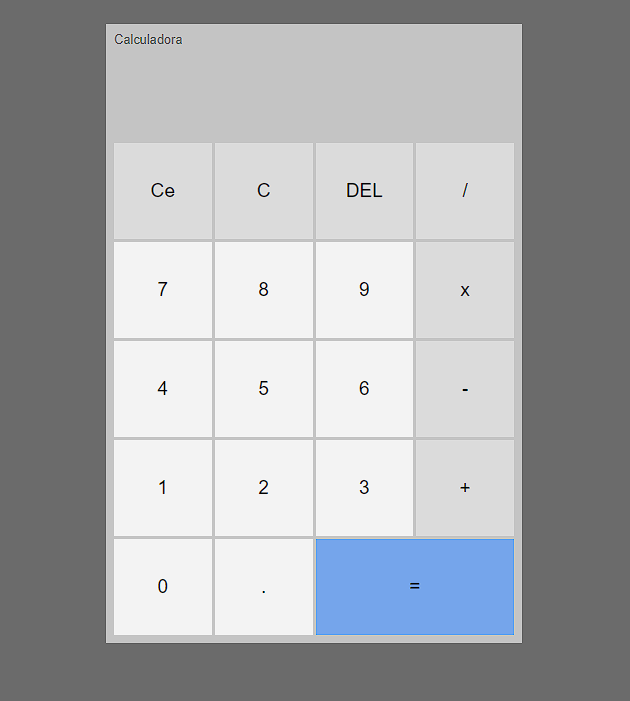

# my-projects
 Meus projetos pessoais para estudo e treino de HTML5, CSS3 e JavaScript.
 My person projects for study and training about HTML5, CSS3 and JavaScript.
 
<a href="https://viniciuslavouraa.github.io/my-projects/wikpedia/index.html" target="_blank">Wikpedia site(Lista de presidentes)</a> 
<a href="https://viniciuslavouraa.github.io/my-projects/spotify/index.html" target="_blank">Site do Spotify</a> 
<a href="https://viniciuslavouraa.github.io/my-projects/imc/" target="_blank">Calculador de IMC</a> 
<a href="https://viniciuslavouraa.github.io/my-projects/calculadora/" target="_blank">
Calculadora</a> 
<a href="https://viniciuslavouraa.github.io/my-projects/landingpage01/" target="_blank">Landing Page 01</a> 
